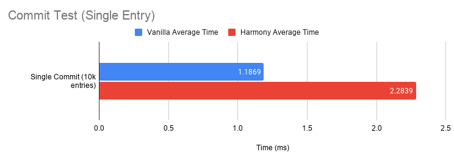
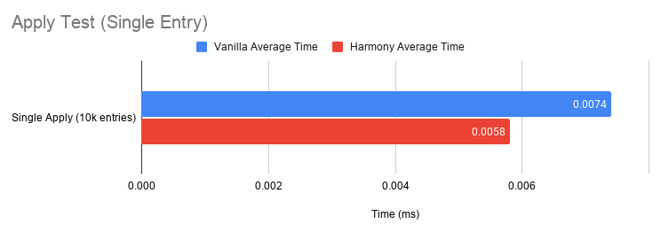

# Harmony Preferences
[](https://circleci.com/gh/pablobaxter/Harmony/tree/master)

 [](https://android-arsenal.com/api?level=14)

Working on multiprocess Android apps is a complex undertaking. One of the biggest challenges is managing shared data between the multiple processes. Most solutions rely on one process to be available for another to read the data, which can be quite slow and could potentially lead to ANRs.

Harmony is a thread-safe, process-safe, full [`SharedPreferences`](https://developer.android.com/reference/android/content/SharedPreferences) implementation. It can be used in place of [`SharedPreferences`](https://developer.android.com/reference/android/content/SharedPreferences) everywhere.

## Features
- Built to support multiprocess apps
- Each process can open a Harmony `SharedPreference` object, without requiring another process to start
- Full [`SharedPreferences`](https://developer.android.com/reference/android/content/SharedPreferences) implementation
- [`OnSharedPreferenceChangeListener`](https://developer.android.com/reference/android/content/SharedPreferences.OnSharedPreferenceChangeListener) emits changes made by other processes
- Uses no native code (NDK) or any [`ContentProvider`](https://developer.android.com/reference/android/content/ContentProvider), [`Service`](https://developer.android.com/reference/android/app/Service), [`BroadcastReceiver`](https://developer.android.com/reference/android/content/BroadcastReceiver), or [AIDL](https://developer.android.com/guide/components/aidl)
- Built-in failed-write recovery similar to the default [`SharedPreferences`](https://developer.android.com/reference/android/content/SharedPreferences)
- Supports Android API 14+

## Download
### Gradle
```
implementation 'com.frybits.harmony:harmony:1.0.0'
```

## Usage

### Creating Harmony SharedPreferences
#### Kotlin
```kotlin
// Getting Harmony SharedPreferences
val prefs: SharedPreferences = context.getHarmonySharedPreferences("PREF_NAME")
```

#### Java
```java
// Getting Harmony SharedPreferences
SharedPreferences prefs = Harmony.getSharedPreferences(context, "PREF_NAME")
```

Once you have this `SharedPreferences` object, it can be used just like any other `SharedPreferences`. The main difference with Harmony is that any changes made to `"PREF_NAME"` using `apply()` or `commit()` is reflected across all processes.

**NOTE: Changes in Harmony do not reflect in Android SharedPreferences and vice-versa!** 

:warning: **WARNING:** Calling `apply()` in quick succession could create a large enough queue of jobs for writing to the underlying data file, that it will delay the data replication across processes (up to a 25 second delay when calling `apply()` 1k times in a loop). When possible, put all the data to write in the `Editor` object before calling `apply()` or `commit()`.

## Performance
All tests were performed on a Samsung Galaxy S9 (SM-G960U) running Android 10.

### Commit (Single Entry) Test
Test setup:
- Harmony preferences are cleared before the start of the test
- Each test creates a single `Editor` object
- Each time an entry is set on the `Editor`, `commit()` was called immediately
- Each test inserted 1k `long` values
- The time measured is the duration it took to complete all 1k inserts
- This test was run 10 times, with the results based off of all 10k entries

The source code for this test can be found in [`HarmonyPrefsCommitActivity`](./app/src/main/java/com/frybits/harmony/app/test/singleentry/commit/HarmonyPrefsCommitActivity.kt)



**Summary:** This result is expected. Harmony will perform a commit that is slightly slower than the vanilla SharedPreferences due to file locking occurring within Harmony.

### Apply (Single Entry) Test
Test setup:
- Harmony preferences are cleared before the start of the test
- Each test creates a single `Editor` object
- Each time an entry is set on the `Editor`, `apply()` was called immediately
- Each test inserted 1k `long` values
- The time measured is the duration it took to complete all 1k inserts
- This test was run 10 times, with the results based off of all 10k entries
- **NOTE: This is the worst case scenario for multiprocess replication, and not recommended for production use!**

The source code for this test can be found in [`HarmonyPrefsApplyActivity`](./app/src/main/java/com/frybits/harmony/app/test/singleentry/apply/HarmonyPrefsApplyActivity.kt)



**Summary:** A lot of work has gone to improve the memory commit speed when calling `apply()`. However, the vanilla SharedPreferences is still faster, meaning that Harmony still has room to improve when calling `apply()`.

## Inter-Process Replication Test
Test Setup:
- Uses the `HarmonyPrefsCommitActivity` test
- Harmony preferences are cleared before the start of the test
- Each entry is the current time on the activity process right before `commit()` is called
- A service called `HarmonyPrefsReceiveService` is listening on another processes using the `OnSharedPreferenceChangeListener`
- On every key change, the current time is taken on the service process, and compared against the received time from the activity process
- This test was run 10 times, with the results based off of all 10k entries
- Results (sorry, no pretty graph):
  - **Min time:** `4 ms`
  - **Max time:** `102 ms`
  - **Average time:** `25.7527 ms`

## Change Log
### Version 1.0.0 / 2020-05-23
- **FIRST MAJOR RELEASE!**
- Fixes a bug where `getAll()` only holds `long` numbers, instead of `int` and `float`
- Fixes a but where lock files could be deleted but not recreated, causing a crash
- Changes underlying data structure (BREAKING CHANGE)
- Updates Kotlin Coroutines library
- Updates min Android SDK to API 14
- Adds instrumented tests via Firebase Test Lab
- Added additional tests, especially around testing Harmony in multiprocess
- Change to underlying cast, to match documentation of [SharedPreferences](https://developer.android.com/reference/android/content/SharedPreferences)

### Version 0.0.7 / 2020-05-20
- Slight improvement to `apply()` performance
- Adds code for performance testing of Harmony vs SharedPreferences
- Removes unused library from example app ([MMKV](https://github.com/Tencent/MMKV))

### Version 0.0.6 / 2020-05-15
- License change from MIT to Apache-2.0

### Version 0.0.5 / 2020-05-15
- Adds java doc (Dokka HTML) to this release
- Prep work to release on Maven Central

### Version 0.0.2 / 2020-05-15
- Removes `app_name` from the `strings.xml` file
- Restructures library to be under the package `com.frybits.harmony`
  instead of `com.frybits.harmonyprefs`
- Renames the `Harmony` class to `HarmonyImpl` and sets class to
  private.
- Import of `getHarmonySharedPreferences()` method is now cleaner

### Version 0.0.1 / 2020-05-15
- Initial release!

## License
```
   Copyright 2020 Pablo Baxter

   Licensed under the Apache License, Version 2.0 (the "License");
   you may not use this file except in compliance with the License.
   You may obtain a copy of the License at

       http://www.apache.org/licenses/LICENSE-2.0

   Unless required by applicable law or agreed to in writing, software
   distributed under the License is distributed on an "AS IS" BASIS,
   WITHOUT WARRANTIES OR CONDITIONS OF ANY KIND, either express or implied.
   See the License for the specific language governing permissions and
   limitations under the License.
```
